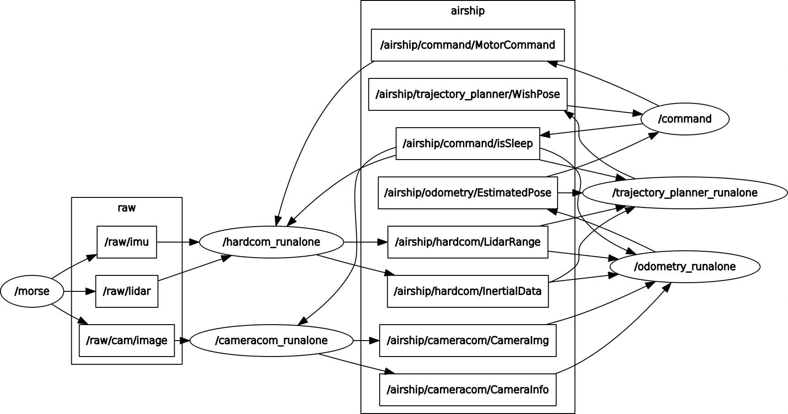

# Airship software

This is a school project to make an autonomous indoor airship. This package contain all the software suit to run a simulation of the airship controlled by keyboard. It entierly write in python.

## Getting Started


### Prerequisites

We choose to use morse simulator your can find the install instruction on :
* [Morse](https://www.openrobots.org/morse/doc/1.2/user/installation.html) - The simulator used

This project is a ROS project. We used kinetic distro :
* [ROS Kinetic](http://wiki.ros.org/kinetic/Installation) - The middleware used
Install the full package, we need rospy of course


### Installing

When you have installed all of this software, you will need to import the simulation we used

* [Airship keyboard simulation](https://github.com/eHuisse/airship_keyboard_morse) - Simulation

Copy this package in :
```sh
~/catkin_ws/src
```
Then, perform a (in the ~/catkin_ws):
```sh
catkin_make
```
Don't forget to source catkin (in the ~/catkin_ws):
```sh
source devel/setup.bash
```

### Test
When every thing is done, you should be able to run the simulation:
```sh
morse run airship_keyboard
roslaunch airship_keyboard keyboard_sim.launch 
```
You should get this with
```sh
rosrun rqt_graph rqt_graph 
```



